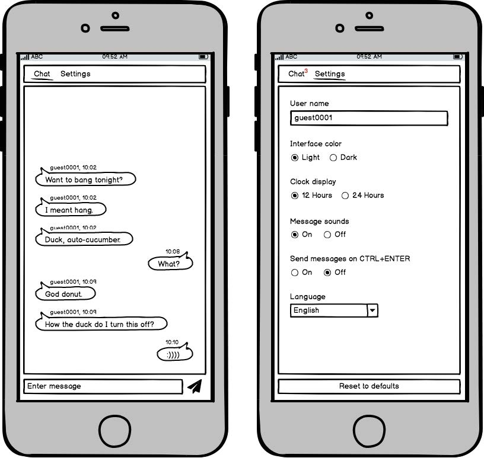

# Sprint 1 - Deadline May 7th
- [X] Scaffolding
- [X] Add support preprocessor
- [X] Structure
- [ ] Main CSS

# Sprint 2 - Deadline May 8th
- [ ] I18n
- [ ] HTML Tab
- [ ] CSS Tab (Light)
- [ ] CSS Tab (Responsive)
- [ ] HTML Settings Page
- [ ] HTML Chat Page
- [ ] CSS Settings Page (Light)
- [ ] CSS Settings Page (Responsive)
- [ ] CSS Chat Page (Light)
- [ ] CSS Chat Page (Responsive)

# Sprint 3 - Deadline May 9th
- [ ] CSS Tab (Dark)
- [ ] CSS Chat Page (Dark)
- [ ] CSS Settings Page (Dark)
- [ ] I18n Local Storage
- [ ] User name Local Storage
- [ ] Interface color Local Storage
- [ ] Reset Local Storage

# Sprint 4 - Deadline May 11th
- [ ] Add socket.io
- [ ] Send message
- [ ] Receive message

# Sprint 5 - Deadline May 12th
- [ ] Test
- [ ] Docs
- [ ] JSdoc markdown
- [ ] CSS Modules

# Optional
- [ ] Date time in chat
- [ ] Date Local Storage
- [ ] Parser links as anchor
- [ ] Blink Tab
- [ ] Smiles support
- [ ] Unread messages count
- [ ] Parser Youtube link
- [ ] Link to an image

